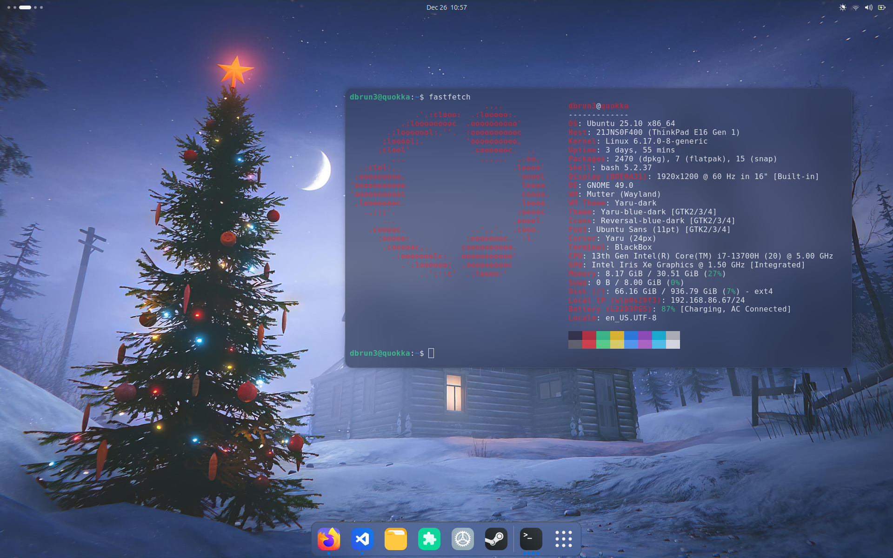
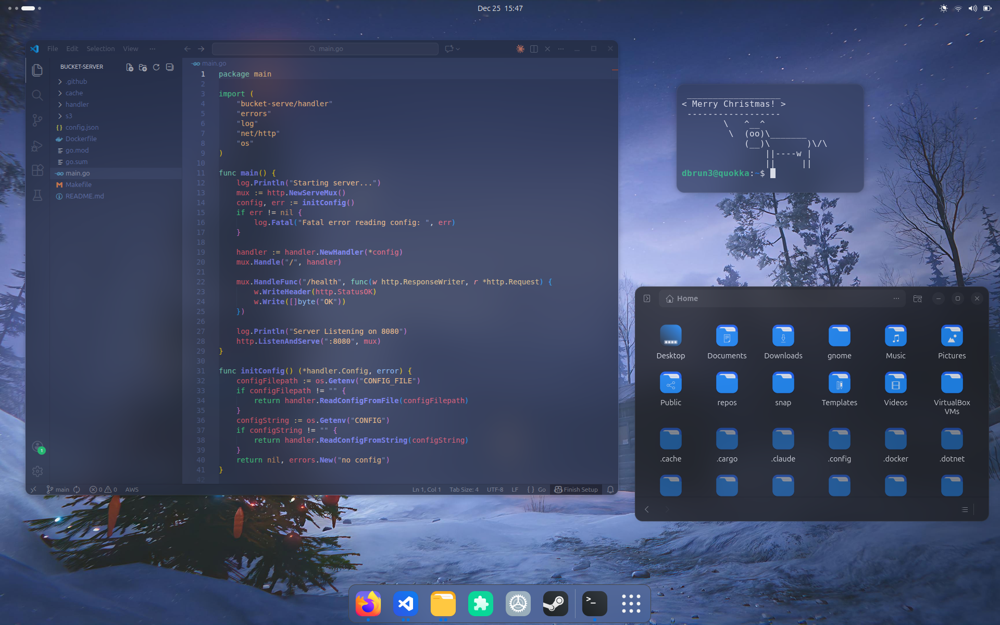

# Blur My Rounded Window Corners

Patches for the [blur-my-shell](https://github.com/aunetx/blur-my-shell) and [rounded-window-corners](https://github.com/flexagoon/rounded-window-corners) gnome extensions and the Gnome Shell by [@kancko](https://github.com/kancko) (shell and original bms patch), [@MeguMario](https://github.com/MeguMario) (ui for blur radius controller) and [@Shneegans](https://github.com/Schneegans/) (bms compatibility for rounded corners) with a small bug fix by myself.

I'll also be including the prebuilt extensions as a release which I'll be maintaining each fork for [blur-my-shell](https://github.com/dbrun3/blur-my-shell) and [rounded-window-corners](https://github.com/dbrun3/rounded-window-corners) alongside the .deb files for the ubuntu version of the gnome-shell for anyone who just wants to install and go right away.